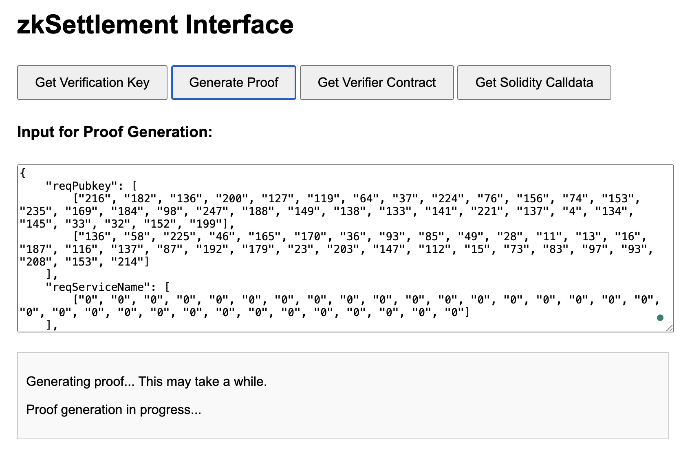

# Background
> 0G serving network adopts a free marketplace where users and service providers decide the prices of the services through a peer-to-peer fashion. The service provider is free to quote their services, and then users are free to choose the services that are priced appropriately for them to use.
> The service provider can decide at any point to send the request traces with user’s signature to the smart contract for settlement. Once settlement is done, the corresponding portion of the pre-charged fee can be sent to service provider’s account. 

Users and service providers conduct off-chain service transactions, and service providers can consume the _request traces_ generated from each service transaction to settle service fees on-chain and update user balances.

# Why zk？
As shown in the figure above, on-chain nodes need to execute all complete state transition processes sequentially, which is often costly. With the introduction of zk:

1. Multiple state transition processing can be batched into one init to final state transition.
2. On-chain nodes only need to execute the proof verification process, which is often relatively cheap.
# Design
## Single request
The request contains the following metadata such as:

1. nonce
2. service_type
3. user_addressand  
4. ...

The request is signed by the user. 
For each settlement of a request, the content of the request needs to meet the following assertions，here called _the_ _content check_:

1. signature.valid == true
2. request.nonce == user_address.nonce + 1
3. service_type.price <= user_address.balance
4. user_address.balance -= service_type.inputPrice * request.inputCount  + service_type.outputPrice * request.ouputCount 
5. server_address == server_address<circuit's public input>
6. server_address.balance += service_type.inputPrice * request.inputCount  + service_type.outputPrice * request.ouputCount 
7.  service_type.updatedAt < request.createdAt

Therefore, the server as the prover needs to prove that these assertions hold. Additionally, considering data visibility, where the verification nodes as verifiers cannot see the request and its signature, what the prover needs to prove should be expanded to:
_From the server perspective, he/she want to settle a request:_

1. _The signature of the request can be successfully verified using the pubkey corresponding to the user_address in the request;_
2. _I'm the server recorded in the request;_
3. _The nonce in the request is valid;_
4. _The balance of user_address is not less than the fee calculated from the count and the price corresponding to service_type in the request;_
5. _In the new state, the balance reduction fee for user_address is correct;_
6. _In the new state, the balance increase fee for server_address is correct;_


The above 6 assertions from the server perspective include the following issues that need to be solved in addition to _the content check_.

1. How to obtain user_address.balance in the circuit through user_address?
2. How to obtain the account's nonce in the circuit through user_address?
3. How to obtain the pubkey in the circuit through user_address?
4. How to obtain the service's price in the circuit through service_type?

For issues 1 and 2, I believe a commit scheme should be added to organize the account information, form a commitment, and store it in the contract~~, such as a simple Merkle tree or a more efficient Verkle tree. Here is to use a Merkle tree~~. (In the new scheme, only need to commit the account, and there is no need to organize all the accounts into merkel tree.)
As shown in step 2, the server~~ downloads the aux data for calculating the path from the chain and then~~ proves that the content of the request can correctly calculate the same target commitment.

For issues 3 and 4, as shown in step 3, mappings can be implemented using lookup. Lookup can be implemented using the plookup algorithm or by interpolating the mappings into polynomials. The former is more suitable for sparse user_address, while the latter is more suitable for service_type.
Once these issues are resolved, as shown in step 4, the validity of the signature and as shown in step 5, the correctness of the state transition (_that is, the previous content check and the new target commitment computation_) can be further proven. 
After the proof is verified, as shown in step 6, the account state and server balance recorded on the chain can be changed.
## Request trace
For request trace, it is easy to extend _the content check_ to prove the settlement of request trace.
# Dependence
### Linux
node-v20.5.0
### mac
node-v20.15.1

Note: The above version is the version that has passed the verification, and is not the only or minimum version.
# Quick
## Compile circuit
```shell
yarn compile
```
## Trust setup
```shell
yarn setup
```
## Access with web
Open your web browser (such as Chrome, Firefox, etc.). Enter in the address bar: http://[server IP address]:3000 (for example: http://127.0.0.1:3000). You should see the zkSettlment prover agent web interface.


The web interface provides the following functionalities:
### Get Verification Key

1. Click the "Get Verification Key" button.
2. The agent will display the verification key.
### Generate Proof

1. Enter the required input data (in JSON format) in the text box.
2. Click the "Generate Proof" button.
3. The agent will generate the proof and display the result.
### Get Verifier Contract

1. Click the "Get Verifier Contract" button.
2. The agent will generate and display the Solidity verifier contract code.
### Get Solidity Calldata

1. If it's the first time or you need to use new input data, enter the required input data (in JSON format) in the text box.
2. Click the "Get Solidity Calldata" button.
3. The agent will generate and display the Solidity Calldata.

Note: For subsequent Calldata retrievals, if no new input data is provided, the agent will use the previously saved data.
## Access with CURL
You can use the zkSettlement prover agent's functionalities by directly calling the API. Here are the usage methods for each API endpoint:
### Get Verification Key

- **URL**: http://[server IP address]:3000/vkey
- **Method**: GET
- **Response**: Verification key in JSON format

Example (using curl):
```shell
curl http://127.0.0.1:3000/vkey
```
### Generate Proof

- **URL**: http://[server IP address]:3000/prove
- **Method**: POST
- **Content Type**: application/json
- **Request Body**: Input data in JSON format
- **Response**: Proof result in JSON format

Example (using curl):
```shell
curl -X POST -H "Content-Type: application/json" -d '{
    "reqPubkey": [
        ["216", "182", "136", "200", "127", "119", "64", "37", "224", "76", "156", "74", "153", "235", "169", "184", "98", "247", "188", "149", "138", "133", "141", "221", "137", "4", "134", "145", "33", "32", "152", "199"],
        ["136", "58", "225", "46", "165", "170", "36", "93", "85", "49", "28", "11", "13", "16", "187", "116", "137", "87", "192", "179", "23", "203", "147", "112", "15", "73", "83", "97", "93", "208", "153", "214"]
    ],
    "reqServiceName": [
        ["0", "0", "0", "0", "0", "0", "0", "0", "0", "0", "0", "0", "0", "0", "0", "0", "0", "0", "0", "0", "0", "0", "0", "0", "0", "0", "0", "0", "0", "0", "0", "0"]
    ],
    "reqInputCount": [
        ["1", "0", "0", "0"]
    ],
    "reqOutputCount": [
        ["2", "0", "0", "0"]
    ],
    "reqNonce": [
        ["1", "0", "0", "0"]
    ],
    "r": [
        ["241", "138", "6", "230", "249", "220", "160", "81", "149", "128", "226", "168", "208", "145", "107", "173", "142", "71", "176", "185", "9", "197", "41", "105", "160", "140", "228", "5", "68", "76", "45", "244"]
    ],
    "s": [
        ["81", "45", "243", "130", "59", "91", "249", "1", "14", "109", "23", "223", "247", "187", "165", "97", "59", "34", "74", "0", "66", "146", "120", "51", "122", "249", "25", "254", "182", "116", "74", "105"]
    ],
    "accUserAddress": ["160", "36", "237", "78", "153", "28", "181", "115", "108", "239", "155", "152", "125", "7", "254", "216", "182", "56", "77", "107"],
    "accProviderAddress": ["143", "110", "41", "72", "222", "16", "210", "85", "166", "97", "47", "135", "245", "236", "81", "45", "183", "247", "171", "126"],
    "accBalance": ["10", "0", "0", "0", "0", "0", "0", "0", "0", "0", "0", "0", "0", "0", "0", "0"],
    "accNonce": ["0", "0", "0", "0"],
    "priceTableKeys": [
        ["0", "0", "0", "0", "0", "0", "0", "0", "0", "0", "0", "0", "0", "0", "0", "0", "0", "0", "0", "0", "0", "0", "0", "0", "0", "0", "0", "0", "0", "0", "0", "0"],
        ["1", "0", "0", "0", "0", "0", "0", "0", "0", "0", "0", "0", "0", "0", "0", "0", "0", "0", "0", "0", "0", "0", "0", "0", "0", "0", "0", "0", "0", "0", "0", "0"],
        ["2", "0", "0", "0", "0", "0", "0", "0", "0", "0", "0", "0", "0", "0", "0", "0", "0", "0", "0", "0", "0", "0", "0", "0", "0", "0", "0", "0", "0", "0", "0", "0"]
    ],
    "priceTableValues": [
        ["1", "0", "0", "0"],
        ["3", "0", "0", "0"],
        ["5", "0", "0", "0"]
    ]
}' http://127.0.0.1:3000/prove
```
Note: require significant computation, some time may be needed to complete.
### Get Verifier Contract

- **URL**: http://[server IP address]:3000/verifier-contract
- **Method**: GET
- **Response**: Verifier contract code in Solidity format

Example (using curl):
```shell
curl http://127.0.0.1:3000/verifier-contract
```
### Get Solidity Calldata

- **URL**: http://[server IP address]:3000/solidity-calldata
- **Method**: POST
- **Content Type**: application/json
- **Request Body**: Input data in JSON format (for first call or when new input is needed)
- **Response**: Solidity Calldata in JSON format

Example (using curl):
```shell
curl -X POST -H "Content-Type: application/json" -d '' http://127.0.0.1:3000/solidity-calldata
```
Note: For subsequent calls, if no new input data is needed, you can send an empty JSON object {}.
